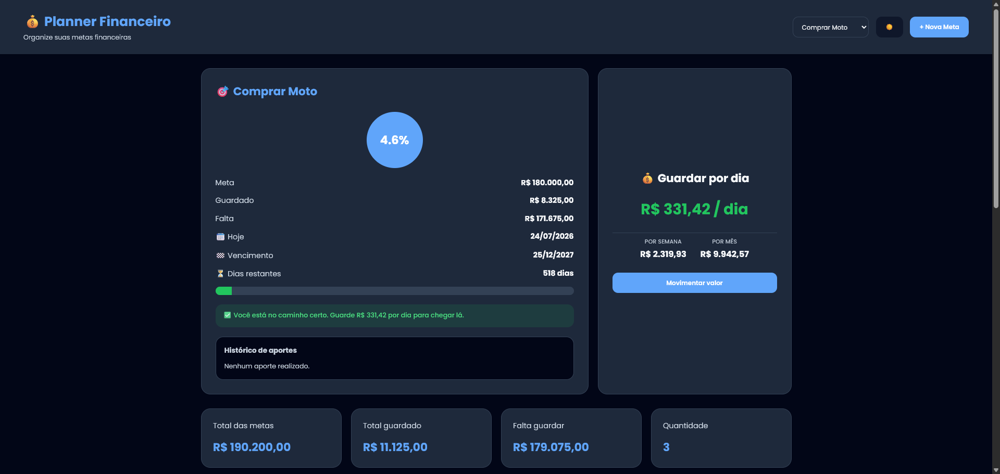
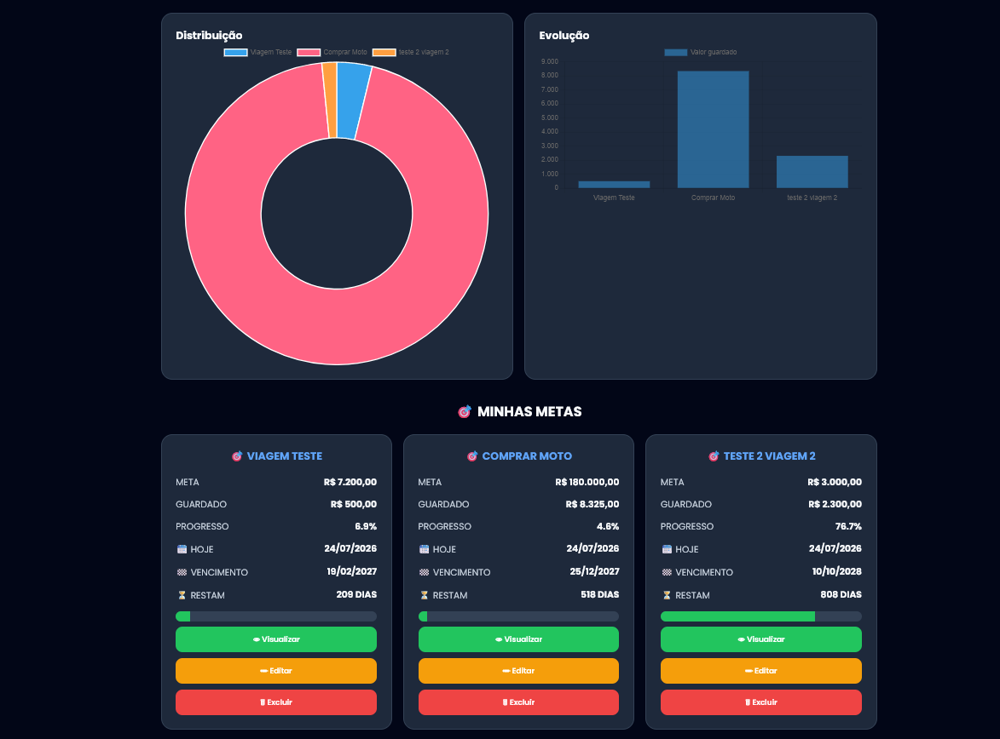

<div align="center">

# 💰 Planner Financeiro

**Um PWA (Progressive Web App) para organizar metas financeiras, calcular quanto guardar por dia e acompanhar sua evolução — instalável no celular, funciona offline e roda 100% em JavaScript puro.**

[](#)
[](#)
[](#)
[](#)
[](#)
[](https://bswbruno.github.io/PlannerFinanceiro/)

### 🔗 [Acessar o app ao vivo](https://bswbruno.github.io/PlannerFinanceiro/)

[Funcionalidades](#-funcionalidades) · [Tecnologias](#-tecnologias) · [Deploy](#-deploy-no-github-pages)

</div>

<br>

## 📸 Preview

<div align="center">

<!--
  Coloque os prints do projeto em docs/screenshots/ e ajuste os nomes abaixo.
  Dica: um GIF curto mostrando o fluxo (criar meta → aporte → dashboard) vende muito bem no portfólio.
-->





<br><br>


&nbsp;&nbsp;


</div>

<br>

## 🎯 Sobre o projeto

O **Planner Financeiro** nasceu de um problema bem prático: como saber, todos os dias, **quanto eu preciso guardar** para bater cada uma das minhas metas financeiras antes do prazo?

O app centraliza várias metas (viagem, reserva de emergência, um curso, uma compra) e calcula automaticamente, para cada uma, o valor diário necessário até o vencimento além de dar uma visão consolidada em dashboard, gráficos de distribuição/evolução e histórico de aportes e retiradas.

Foi construído **sem frameworks**, com HTML, CSS e JavaScript puro, como exercício de fundamentar bem os conceitos de DOM, estado em memória, persistência local e Service Workers e para entregar uma experiência de app nativo (instalável, responsivo, offline-first) usando só tecnologias web nativas.

## ✨ Funcionalidades

- 🎯 **Metas ilimitadas** — cadastro com nome, valor alvo, valor inicial e data de vencimento
- 📊 **Dashboard consolidado** — total das metas, total guardado, quanto falta e quantidade de metas ativas
- 💸 **Aportes e retiradas** — registre movimentações em cada meta, com histórico completo e cores diferenciando entrada/saída
- 📈 **Gráficos dinâmicos** — distribuição entre metas e evolução ao longo do tempo (Chart.js)
- 🧠 **Análise automática** — mensagens contextuais por meta ("reta final", "no caminho certo", "meta vencida"), calculadas a partir do prazo e do progresso
- 🌗 **Tema claro/escuro** — com preferência salva
- 📱 **PWA instalável** — manifest + Service Worker configurados para instalação no celular e uso offline
- 💾 **Persistência local** — tudo salvo em `localStorage`, sem depender de backend
- 📐 **100% responsivo** — layout adaptado para desktop, tablet e celular, com áreas de toque otimizadas para mobile

## 🛠 Tecnologias

| Camada | Stack |
|---|---|
| Estrutura | HTML5 semântico |
| Estilo | CSS3 (variáveis, Grid, Flexbox, media queries) |
| Interatividade | JavaScript (ES6+), sem frameworks |
| Gráficos | [Chart.js](https://www.chartjs.org/) |
| Persistência | `localStorage` |
| PWA | Web App Manifest + Service Worker (cache offline) |
| Tipografia | Google Fonts (Poppins) |

## 📂 Estrutura do projeto

```
Planner Financeiro/
├── index.html              # Estrutura da aplicação
├── manifest.json            # Configuração do PWA (ícones, tema, instalação)
├── service-worker.js        # Cache offline
├── css/
│   ├── style.css             # Estilos base (desktop)
│   └── styleMobile.css       # Ajustes responsivos (≤ 600px)
├── js/
│   └── script.js             # Toda a lógica: metas, aportes, gráficos, tema
├── assets/
│   └── icon-192.png / icon-512.png   # Ícones do PWA
└── docs/
    └── screenshots/          # Imagens usadas neste README
```

## ▶️ Como rodar localmente

Por ser um projeto 100% estático, não precisa de build nem de instalação de dependências.

```bash
# clone o repositório
git clone https://github.com/bswbruno/PlannerFinanceiro.git
cd PlannerFinanceiro

# sirva os arquivos com qualquer servidor estático
npx serve .
# ou
python3 -m http.server 8080
```

Depois é só abrir `http://localhost:8080` no navegador.

> ⚠️ O Service Worker só registra em `http://`/`https://` (inclusive `localhost`) — abrindo o `index.html` direto como arquivo (`file://`) o app funciona normalmente, só o cache offline fica desativado.

### Instalando no celular

1. Acesse o site publicado pelo navegador do celular (Chrome/Safari)
2. Toque em **Adicionar à tela inicial** / **Instalar app**
3. Pronto o Planner Financeiro passa a abrir como um app nativo, com ícone próprio e funcionando offline

## 🗺 Próximos passos

- [ ] Exportar/importar dados (backup em JSON)
- [ ] Notificações locais de vencimento próximo
- [ ] Múltiplas moedas
- [ ] Testes automatizados (unitários para as funções de cálculo)

## 👤 Autor

Feito por **Bruno Santos**

[](https://www.linkedin.com/in/wanderley-bruno/)
[](https://github.com/bswbruno)

---

<div align="center">Se este projeto foi útil ou você gostou da ideia, deixe uma ⭐ no repositório!</div>
